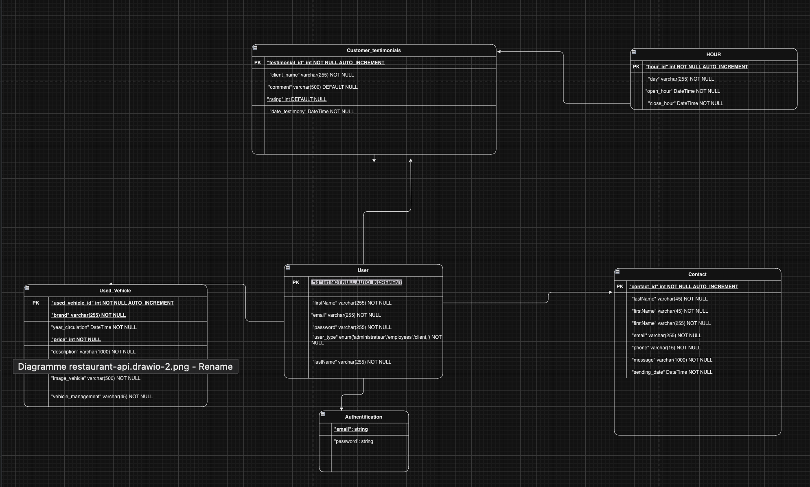
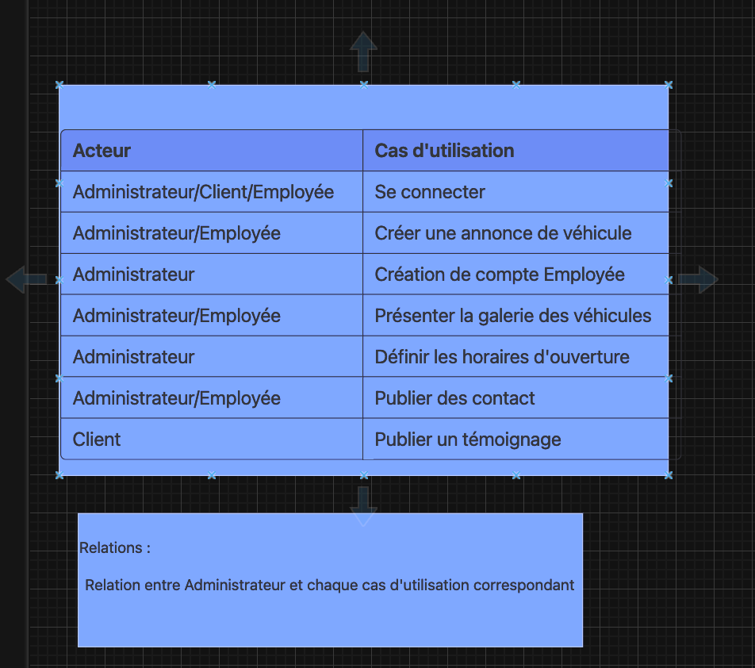
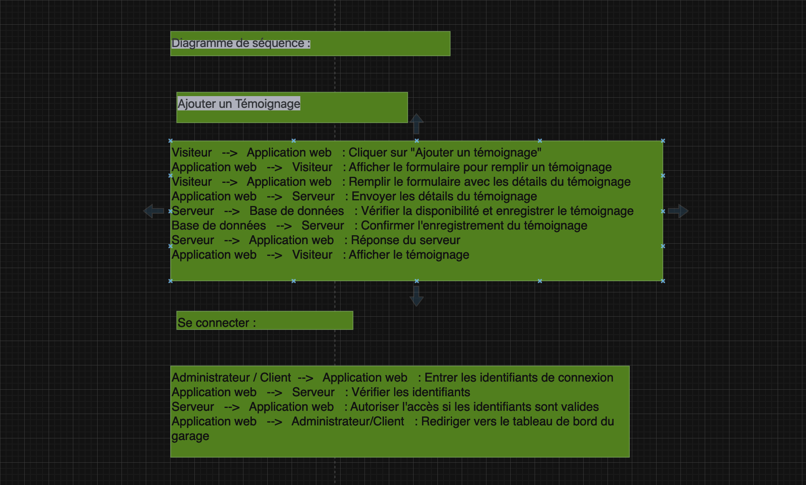
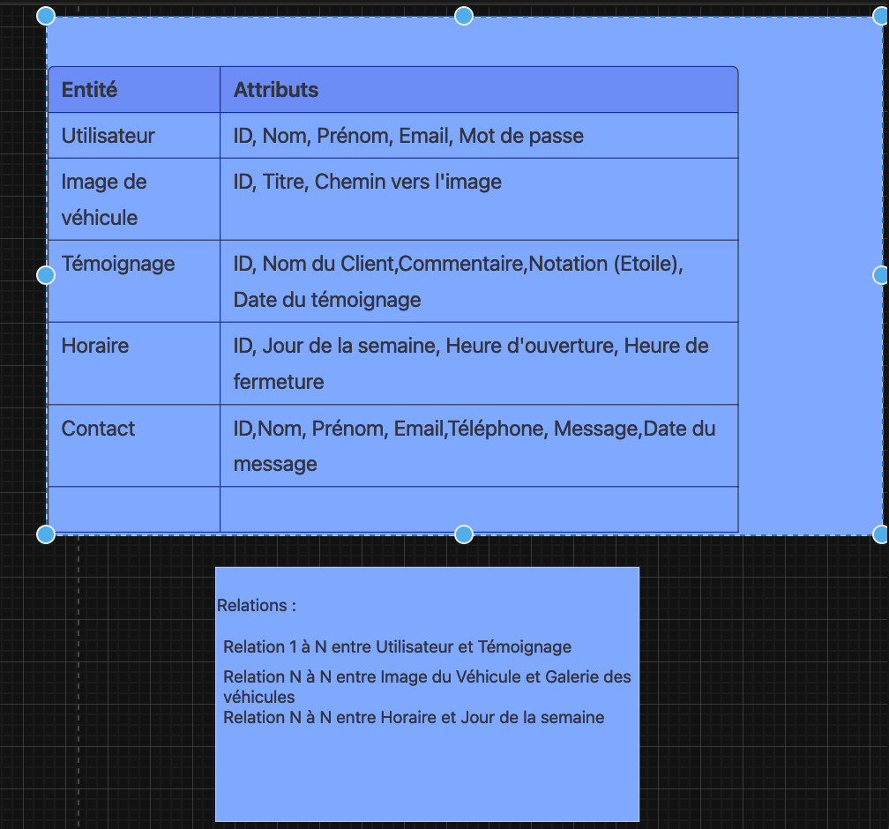

# Projet API Véhicules d'Occasion

Ce projet est une API Laravel qui gère les véhicules d'occasion. Il permet aux utilisateurs de créer, lire, mettre à jour et supprimer des annonces de véhicules d'occasion. L'API offre également des fonctionnalités pour récupérer une liste de véhicules disponibles et obtenir des détails sur un véhicule particulier.

## Configuration requise

Avant de commencer, assurez-vous d'avoir les éléments suivants installés sur votre système :

- PHP 7.4 ou version ultérieure
- Composer (pour gérer les dépendances PHP)
- Laravel CLI (pour lancer le serveur de développement)
- MySQL ou un autre système de gestion de base de données pris en charge par Laravel

## Installation

1. Clonez ce dépôt sur votre machine locale :

   ```bash
   git clone https://github.com/votre-utilisateur/votre-projet.git
   ```
    ```bash
   cd votre-projet
   ```
    ```bash
   composer install
   ```

   Copier le fichier .env.example en .env et configurer vos variables d'environnement, notamment la configuration de la base de données.

    ```bash
    php artisan key:generate
    php artisan migrate
    php artisan serve
    ```

    L'application devrait maintenant être accessible à l'adresse http://localhost:8000 par défaut.

## Configuration
Assurez-vous de configurer correctement le fichier .env avec les détails de votre environnement, y compris les informations de base de données, les informations d'envoi de courrier électronique, etc.

## Utilisation
L'application Garage ECF est conçue pour être utilisée par le personnel du garage automobile. Vous pouvez ajouter, mettre à jour et supprimer des véhicules d'occasion, gérer les témoignages clients, traiter les demandes de contact et gérer les utilisateurs.

## Endpoints de l'API
L'application dispose d'une API pour gérer les données. Voici quelques-uns des principaux endpoints de l'API :

- /api/used/vehicles: Obtenir la liste des véhicules d'occasion.
- /api/used/vehicle/add: Ajouter un nouveau véhicule d'occasion.
- /api/customer/testimonials: Obtenir la liste des témoignages clients.
- /api/customer/testimonial/add: Ajouter un nouveau témoignage client.

# Diagramme UML







